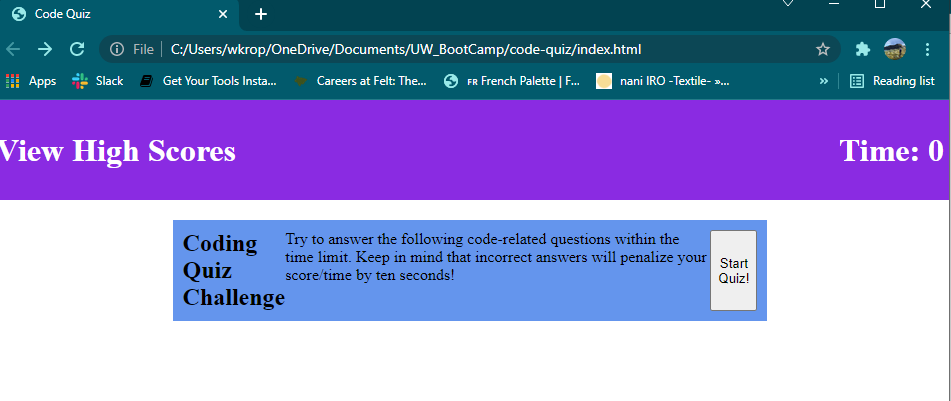

# Code Quiz
## Timed quiz with multiple choice questions
* Click the button to start the quiz and a 60 second timer will start counting down.
* Click on an answer and dynamically generated text will appear below saying whether or not you were correct.
    * If you were correct, add 5 seconds to the timer.
    * Pull up next question.
* If all questions have been answered, generate username / score input card.
    * Take initials.
    * Time left = score.
    * Click submit button.
* Generate high score list
    * local storage
    * reset button to delete local storage
    * go back button takes to start page

# Deployment

[Github Repository](https://github.com/wkropat/code-quiz)  

[Live Website](https://wkropat.github.io/code-quiz/)

# Screenshots

 
